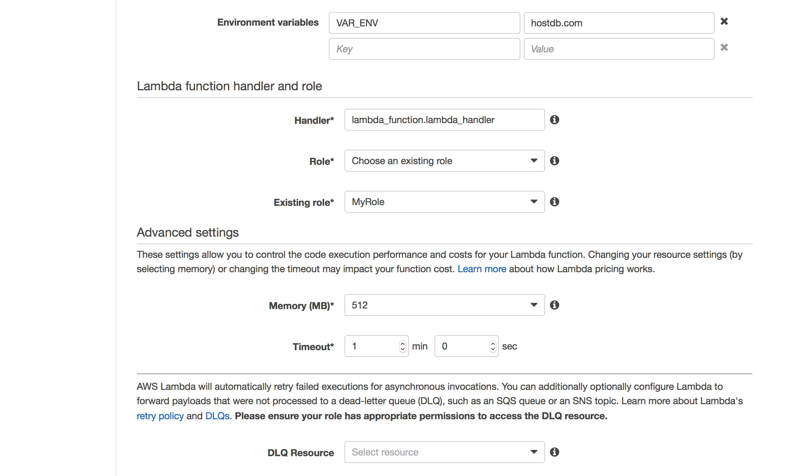
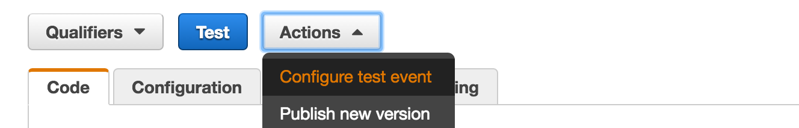

**Meu primeiro Lambda AWS**
======

Olá pessoal, objetivo do post, é auxiliar novos usuários da AWS que tem dúvidas sobre o Lambda.

##### Que tal comecarmos explicando "Oque é Lambda?!""

Para resumir, é uma plataforma "Server-less" da AWS que executa funções de codigo, sem a necessidade de ter uma infraestrutura, seu codigo só executado quando invocado. Chamamos de "Função do Lambda", quando o Lambda for invocado, isso quer dizer que seu codigo foi executado. Usado como servico stateless. No blog tem outros posts sobre Lambda que pode enriquecer o conhecimento sobre Lambda [clique aqui.](http://www.concretesolutions.com.br/?s=lambda&post_type=post)

##### Ta bom! Mas, quando usar?

No caso de uma arquitetura baseada em microserviços será o ideal.

Mas uma recomendação verifique se seu código está coeso, atende aos requisitos minimo de patterns e modularizacao, nossa agora complicou né, haha.

Ok, resumindo podemos quebrar nossa aplicacao e colocarmos algum modulo no Lambda, por exemplo: Em um sistema aonde a granularidade segrega o modulo de login, será que é necessario este servico rodar 24x7x360 em uma VM ?! Isso é disperdicio de recurso, dinheiro gasto sem necessidade. Para resolver isso podemos usar um Lambda. Mas lembre-se devemos tratar o Lambda como serviço stateless.

Por se tratar de um serviço gerenciado pela AWS, usamos quando não queremos se preocupar com a infraestrutura e escalabilidade. Sem esquentar com atualizacao de Sistema Operacional, bugs e etc. Você so precisa determinar a quantidade de memória e o Lambda cuida do resto, CPU, Disco e IO.

Obs, obtenha métricas ou levante todos requisitos necessários para determinar a melhor arquitetura.

Dois exemplos simples de um arquitetura usando Lambda:

Alguns cases de sucesso [clique aqui.](https://aws.amazon.com/pt/solutions/case-studies/all/)

##### E o custo?

Isso é o mais interessante, muitas vezes esse servico sera gratuito. Serio? Sim, a AWS disponibiliza para alguns servicos um "nivel gratuito", no caso do Lambda até 1 milhao de execuções (invocação) e 400.000 GB/segundo de tempo de memoria usada por mês.
Excedendo o nível gratuito, você só paga pelo tempo de execução, o tempo de execução não conta o tempo de iniciar a "instância", e sim a partir do momento que seu codigo inicia e termina, isso é demais.
Mas lembre-se seu codigo teve ficar armazenado em algum lugar! O Lambda armazena no s3, e isso pode gerar um custo baixo. Para detalhes [clique aqui.](https://aws.amazon.com/pt/lambda/pricing/)

##### Nossa marotão!!! Mas oque eu preciso para criar um Lambda?

Aqui tem uma parte chatinha, mas muito importante, você deve criar policies e associar a uma role, com os niveis de permissões necessário, garantindo ainda mais segurança e deixando uma arquitetura muito mais justa. Para detalhes [clique aqui.](http://docs.aws.amazon.com/pt_br/lambda/latest/dg/access-control-identity-based.html)

##### Como nada é perfeito, vejamos alguns pros:

- Não tem suporte para todas linguagens.
- Não esta disponivel em todas regioes da AWS.
- Possui limite de memória, isso pode implicar na performace dependendo da sua aplicação.

---
Criando meu primeiro Lambda
========
Acesse o console da AWS e localize o serviço Lambda:

A AWS fornece "blueprint", templates para auxiliar.
Selecione "Blank Function":

O Lambda trabalha com triggers, muito útil com integrações com outros serviços da AWS, por exemplo o S3, API Gateway e etc. No nosso blog tem alguns exemplos [clique aqui.](http://www.concretesolutions.com.br/?s=lambda&post_type=post)
Mas nesse momento não vamos associar uma trigger:

Adicione as configurações necessarias, conforme exemplo abaixo:

Coloque o código conforme exemplo, repositório [clique aqui.](exemplo):

Na ultima release da AWS, o Lambda recebeu algumas funcionalidades, uma delas é variavel de ambiente.
Selecione a Role (criada para o Lambda), quantidade de memória e tempo para execução do código, com limite até 5 minutos, exemplo:

"DLQ Resource", voce pode usar para caso de falha seja encaminhado para uma fila e ser reprocessado mais tarde ou enviar uma notificacao por e-mail.

Network, selecione a VPC criada para exibir as subnets. É recomendado adicionar duas subnets sendo elas privadas e de zona de disponibilidade diferentes. Também é importante lembrar que o Lambda é um recurso usado em backend, por isso não é necessário adicionar subnet pública.
Selecione um ou mais "Security Groups":

Integração com KMS, é possivel criptografar as variaveis de ambiente. Você pode associar um KMS em uso na conta.
Finalizado a configuracao, aperte "Next":

Validar as configuracoes e selecionar "Create Function":

Após criado, podemos testar nosso código.
Na opção "Actions", selecione "Configure test event":

Coloque os dados abaixo e selecione a opção "Save and test":

Resultado do teste:

_______
Espero que o post ajude os iniciantes no mundo de microservices e cloud computing com o Lambda AWS.

###### Feedbacks são bem-vindo!!! Abraços seus lindos!!
